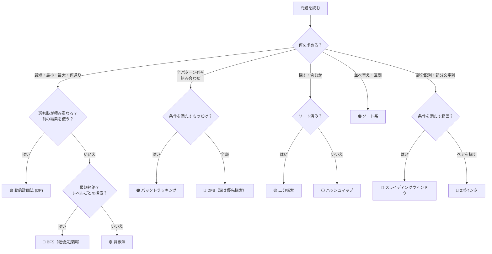

# 🧠 LeetCode アルゴリズム選択ガイド

> **「この問題、どのアルゴリズムを使えばいいの？」** を解決するための早見表

---

## 📋 目次
1. [フローチャート（まず最初に見る）](#-フローチャート)
2. [各アルゴリズムの詳細](#-各アルゴリズム詳細)
3. [キーワード早見表](#-キーワード早見表)

---

## 🔀 フローチャート



---

## 📖 各アルゴリズム詳細

---

### 🟣 動的計画法（DP）

#### 🚨 こう聞かれたらDP！

| キーワード | 例題 |
|---|---|
| **「何通りありますか？」** | Decode Ways, Unique Paths, Climbing Stairs |
| **「最大/最小の〇〇は？」**（累積系） | Maximum Subarray, Coin Change |
| **「可能かどうか？」**（True/False） | Word Break, Jump Game |

#### 🧪 見分けるコツ
```
✅ DPの3つのサイン:
  1. 「i番目の答え」が「i-1番目やi-2番目の答え」から計算できる
  2. 問題に「重なる部分問題」がある（同じ計算を何度もする）
  3. 最適解を求める（最大・最小・数え上げ）

❌ DPではないサイン:
  ・全パターンを列挙する必要がある → バックトラッキング
  ・データ構造の操作がメイン → スタック/キューなど
```

#### 🎯 DPの考え方テンプレ
```
1. dp[i] の定義を決める（「〇〇のときの答え」）
2. 遷移式を見つける（dp[i] = dp[i-1] + dp[i-2] など）
3. 初期値を設定する（dp[0] = ?, dp[1] = ?）
4. ループで埋めて、最後のdpを返す
```

#### 💡 具体例: Decode Ways
```
🔑 「何通りデコードできますか？」→ 数え上げ → DP！
dp[i] = i文字目までのデコード数
dp[i] = dp[i-1]（1文字デコード）+ dp[i-2]（2文字デコード）
```

---

### 🩵 スライディングウィンドウ

#### 🚨 こう聞かれたらスライディングウィンドウ！

| キーワード | 例題 |
|---|---|
| **「連続する部分配列/部分文字列」** | Maximum Subarray, Min Window Substring |
| **「最長の〇〇な部分文字列」** | Longest Substring Without Repeating Characters |
| **「k個の連続する要素」** | - |

#### 🧪 見分けるコツ
```
✅ スライディングウィンドウの2つのサイン:
  1. 「連続する」範囲を扱う
  2. 左端と右端を動かして「窓」のサイズを調整する

❌ スライディングウィンドウではないサイン:
  ・連続していない要素を選ぶ → DP
  ・順番を変えてもOK → ソート/ハッシュ
```

---

### 🩷 2ポインタ（Two Pointers）

#### 🚨 こう聞かれたら2ポインタ！

| キーワード | 例題 |
|---|---|
| **「ペアを見つける」**（ソート済み配列） | Two Sum II, 3Sum |
| **「回文かどうか」** | Valid Palindrome |
| **「マージする」**（2つのソート済み配列） | Merge Sorted Array |
| **「水の量 / 面積」**（棒グラフ系） | Container With Most Water, Trapping Rain Water |

#### 🧪 見分けるコツ
```
✅ 2ポインタの2つのサイン:
  1. ソート済み配列 or 両端から攻める
  2. O(n²) を O(n) に最適化したい

パターン:
  ・左右から挟む → Container With Most Water
  ・同じ方向に進む → Remove Duplicates
```

---

### 🟡 二分探索（Binary Search）

#### 🚨 こう聞かれたら二分探索！

| キーワード | 例題 |
|---|---|
| **「ソート済み配列で探す」** | Search in Rotated Sorted Array |
| **「O(log n) で解け」** | Find Minimum in Rotated Sorted Array |
| **「〇〇の最小値/最大値を探せ」**（答えに対する二分探索） | Koko Eating Bananas |

#### 🧪 見分けるコツ
```
✅ 二分探索のサイン:
  1. ソート済み（or 部分的にソート済み）
  2. 「探す」がメイン
  3. O(log n) が求められる

💡 ソートされてなくても:
  「答えの範囲」が分かっていて、答えに対して二分探索できる場合もある
```

---

### ⚪ ハッシュマップ / ハッシュセット

#### 🚨 こう聞かれたらハッシュ！

| キーワード | 例題 |
|---|---|
| **「含まれるか？」**（O(1)で判定） | Two Sum, Contains Duplicate |
| **「頻度を数える」** | Group Anagrams, Top K Frequent Elements |
| **「重複を排除」** | - |
| **「対応関係を記憶」** | Valid Anagram |

#### 🧪 見分けるコツ
```
✅ ハッシュのサイン:
  1. 「ある値が存在するか」を高速に知りたい
  2. 出現回数を数えたい
  3. 値と値の対応関係を保存したい
```

---

### 🔴 DFS（深さ優先探索）& 🟠 バックトラッキング

#### 🚨 こう聞かれたらDFS / バックトラッキング！

| キーワード | 例題 |
|---|---|
| **「全パターン列挙」** | Subsets, Permutations, Combination Sum |
| **「パスが存在するか」**（グリッド/グラフ） | Word Search, Number of Islands |
| **「木の探索」** | Maximum Depth, Validate BST |

#### 🧪 DFS vs バックトラッキングの違い
```
DFS: 全ノードを訪問する
  → Number of Islands（全マスを見る）

バックトラッキング: 条件に合わないルートを早めに切る
  → Word Search（文字が違ったら戻る）
  → Subsets（組み合わせを生成して戻す）
```

---

### 🔵 BFS（幅優先探索）

#### 🚨 こう聞かれたらBFS！

| キーワード | 例題 |
|---|---|
| **「最短距離/最短手数」** | - |
| **「レベルごと」**（木） | Binary Tree Level Order Traversal |
| **「近い順に探索」** | - |

#### 🧪 見分けるコツ
```
✅ BFSのサイン:
  1. 「最短」を求める（重みなしグラフ）
  2. レベル（深さ）ごとに処理したい
  3. 「近い順」に広がる探索
```

---

### 🟢 貪欲法（Greedy）

#### 🚨 こう聞かれたら貪欲法！

| キーワード | 例題 |
|---|---|
| **「最小の回数で〇〇」** | Jump Game, Jump Game II |
| **「区間のスケジューリング」** | Non-overlapping Intervals, Meeting Rooms |
| **「今の最適な選択 = 全体の最適」** | - |

#### 🧪 見分けるコツ
```
✅ 貪欲法のサイン:
  1. 局所的に最適な選択が全体的にも最適
  2. 一度選んだら戻らない
  3. ソートしてから前から順に処理

⚠️ 注意: 貪欲法 vs DP の判断は難しい
  ・Jump Game → 貪欲法でOK（到達可能範囲を更新するだけ）
  ・Coin Change → 貪欲法はNG（小さい硬貨の組み合わせが必要な場合がある）
```

---

### 🟤 ソート系

#### 🚨 こう聞かれたらソート！

| キーワード | 例題 |
|---|---|
| **「区間をマージ」** | Merge Intervals, Insert Interval |
| **「重なりを検出」** | Meeting Rooms |
| **「並べ替えてから処理」** | 多くの問題の前処理として |

---

## 📌 キーワード早見表

| 問題文のキーワード | → まず試すアルゴリズム |
|---|---|
| 何通り / 方法の数 | 🟣 DP |
| 最大/最小（累積） | 🟣 DP or 🟢 貪欲法 |
| 可能か？(True/False) | 🟣 DP or 🟢 貪欲法 |
| 連続する部分配列/部分文字列 | 🩵 スライディングウィンドウ |
| 最長の / 最短の部分文字列 | 🩵 スライディングウィンドウ |
| ペアを探す / 合計がXになる | 🩷 2ポインタ or ⚪ ハッシュ |
| ソート済み配列で探す | 🟡 二分探索 |
| O(log n)で解け | 🟡 二分探索 |
| 含まれるか / 重複 | ⚪ ハッシュ |
| 出現回数 / 頻度 | ⚪ ハッシュ |
| 全パターン列挙 | 🟠 バックトラッキング |
| グリッド探索 / 島の数 | 🔴 DFS |
| 最短距離 / 最短手数 | 🔵 BFS |
| 区間問題 / スケジューリング | 🟤 ソート → 🟢 貪欲法 |
| 木の探索 | 🔴 DFS or 🔵 BFS |

---

## 🔥 最後のアドバイス

### よく間違えるパターン

| この問題 | 間違えやすい | 正解 | なぜ？ |
|---|---|---|---|
| Jump Game | DP | 🟢 貪欲法 | 到達可能範囲を更新するだけでOK |
| Coin Change | 貪欲法 | 🟣 DP | 貪欲だと最適解を逃す |
| Word Break | DFS | 🟣 DP | 部分問題が重なる |
| Container With Most Water | DP | 🩷 2ポインタ | 両端から挟んで最大を探す |

### 迷ったときの判断基準

```
1. 「何通り？」「最大/最小？」→ まずDPを疑う
2. 配列がソート済み → 二分探索 or 2ポインタ
3. 「連続する」が条件 → スライディングウィンドウ
4. 全列挙 → バックトラッキング
5. 存在確認・頻度 → ハッシュ
6. グラフ/グリッド → DFS or BFS
```
