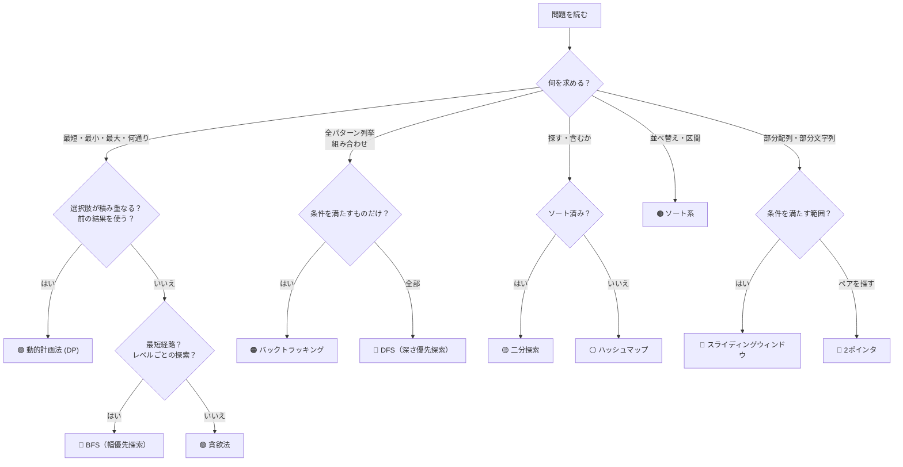

# 🧠 LeetCode アルゴリズム選択ガイド
このmdファイルは、学習して使ったアルゴリズムをAIによってまとめたものです。
> **「この問題、どのアルゴリズムを使えばいいの？」** を解決するための早見表

---

## 📋 目次
1. [フローチャート（まず最初に見る）](#-フローチャート)
2. [各アルゴリズムの詳細](#-各アルゴリズム詳細)
3. [キーワード早見表](#-キーワード早見表)

---

## 🔀 フローチャート



---

## 📖 各アルゴリズム詳細

---

### 🟣 動的計画法（DP）

#### � どんなアルゴリズム？

大きな問題を **小さな部分問題に分割** し、各部分問題の答えを **テーブル（配列）に保存** しながら積み上げていく手法。
一度計算した結果を再利用するので、同じ計算を何度もやる無駄がなくなる。

```
例: フィボナッチ数列
  普通の再帰: fib(5) → fib(4) + fib(3) → fib(3) + fib(2) + ...
    → fib(3) を何度も計算してしまう（指数的に遅い）

  DP: dp[0]=0, dp[1]=1, dp[2]=1, dp[3]=2, dp[4]=3, dp[5]=5
    → 各値を1回だけ計算して表に保存 → O(n) で済む
```

イメージ: **「メモしながら解くパズル」** — 一度解いたピースの答えをメモしておき、次に同じピースが出てきたらメモを見返す。

#### �🚨 こう聞かれたらDP！

| キーワード | 例題 |
|---|---|
| **「何通りありますか？」** | Decode Ways, Unique Paths, Climbing Stairs |
| **「最大/最小の〇〇は？」**（累積系） | Maximum Subarray, Coin Change |
| **「可能かどうか？」**（True/False） | Word Break, Jump Game |

#### 🧪 見分けるコツ
```
✅ DPの3つのサイン:
  1. 「i番目の答え」が「i-1番目やi-2番目の答え」から計算できる
  2. 問題に「重なる部分問題」がある（同じ計算を何度もする）
  3. 最適解を求める（最大・最小・数え上げ）

❌ DPではないサイン:
  ・全パターンを列挙する必要がある → バックトラッキング
  ・データ構造の操作がメイン → スタック/キューなど
```

#### 🎯 DPの考え方テンプレ
```
1. dp[i] の定義を決める（「〇〇のときの答え」）
2. 遷移式を見つける（dp[i] = dp[i-1] + dp[i-2] など）
3. 初期値を設定する（dp[0] = ?, dp[1] = ?）
4. ループで埋めて、最後のdpを返す
```

#### 💡 具体例: Decode Ways
```
🔑 「何通りデコードできますか？」→ 数え上げ → DP！
dp[i] = i文字目までのデコード数
dp[i] = dp[i-1]（1文字デコード）+ dp[i-2]（2文字デコード）
```

#### 💡 具体例: Word Break
```
🔑 「辞書の単語だけで分割できますか？」→ 可能か判定 → DP！
dp[i] = s の先頭 i 文字を辞書の単語だけで分割できるか（True/False）
初期値: dp[0] = True（空文字列は常に分割可能）
遷移: dp[j] が True かつ s[j:i] が辞書にある → dp[i] = True
```

---

###  スライディングウィンドウ

#### 📝 どんなアルゴリズム？

配列や文字列の上に **「窓（ウィンドウ）」** を置き、その窓を **右にスライド** させながら条件を満たす範囲を探す手法。
窓の右端を広げて要素を追加し、条件を満たさなくなったら左端を縮めて調整する。

```
例: "abcabcbb" から重複なしの最長部分文字列を探す
  [a]bcabcbb     → 窓: "a"（長さ1）
  [ab]cabcbb     → 窓: "ab"（長さ2）
  [abc]abcbb     → 窓: "abc"（長さ3）
  a[bca]bcbb     → 次の "a" が重複 → 左端を縮める → 窓: "bca"（長さ3）
  ...繰り返し
```

イメージ: **「電車の窓から景色を見る」** — 窓の大きさを伸び縮みさせながら、条件に合う一番良い景色（範囲）を見つける。

#### 🚨 こう聞かれたらスライディングウィンドウ！

| キーワード | 例題 |
|---|---|
| **「連続する部分配列/部分文字列」** | Maximum Subarray, Min Window Substring |
| **「最長の〇〇な部分文字列」** | Longest Substring Without Repeating Characters |
| **「k個の連続する要素」** | - |

#### 🧪 見分けるコツ
```
✅ スライディングウィンドウの2つのサイン:
  1. 「連続する」範囲を扱う
  2. 左端と右端を動かして「窓」のサイズを調整する

❌ スライディングウィンドウではないサイン:
  ・連続していない要素を選ぶ → DP
  ・順番を変えてもOK → ソート/ハッシュ
```

---

###  2ポインタ（Two Pointers）

#### どんなアルゴリズム？

配列上に **2つの指（ポインタ）を置き**、それぞれを独立に動かしながら目的の条件を探す手法。
主に2パターンある:

```
パターン①: 左右から挟む（向かい合わせ）
  [1, 2, 3, 4, 5, 6, 7]
   L→              ←R     L と R を中央に向けて近づける
  → 合計がXになるペアを探す、水の最大面積など

パターン②: 同じ方向に進む（追いかけっこ）
  [1, 1, 2, 2, 3, 3, 4]
   S→
   F→                     S（遅い）と F（速い）が同じ方向に進む
  → 重複の削除、リンクリストのサイクル検出など
```

イメージ: **「両手の指で挟んで探す」** — 本の両端にしおりを置いて、条件に合うページを探すように中央に向かって近づけていく。

#### �🚨 こう聞かれたら2ポインタ！

| キーワード | 例題 |
|---|---|
| **「ペアを見つける」**（ソート済み配列） | Two Sum II, 3Sum |
| **「回文かどうか」** | Valid Palindrome |
| **「マージする」**（2つのソート済み配列） | Merge Sorted Array |
| **「水の量 / 面積」**（棒グラフ系） | Container With Most Water, Trapping Rain Water |

#### 🧪 見分けるコツ
```
✅ 2ポインタの2つのサイン:
  1. ソート済み配列 or 両端から攻める
  2. O(n²) を O(n) に最適化したい

パターン:
  ・左右から挟む → Container With Most Water
  ・同じ方向に進む → Remove Duplicates
```

---

### 🟡 二分探索（Binary Search）

#### � どんなアルゴリズム？

**ソート済みのデータ** を半分ずつ切り捨てながら目的の値を探す手法。毎回データを半分にするので **O(log n)** という超高速な探索ができる。

```
例: ソート済み配列 [1, 3, 5, 7, 9, 11, 13] から「9」を探す
  → 真ん中は 7。9 > 7 なので右半分だけ見る → [9, 11, 13]
  → 真ん中は 11。9 < 11 なので左半分だけ見る → [9]
  → 見つかった！（たった3回の比較）

※ 全部見る場合: 最大7回 → 二分探索: 最大3回
  要素が100万個でも → 二分探索: 最大20回！
```

イメージ: **「辞書で単語を引く」** — 真ん中のページを開き、探す単語がそれより前か後かで半分に絞る。これを繰り返すとすぐ見つかる。

#### �🚨 こう聞かれたら二分探索！

| キーワード | 例題 |
|---|---|
| **「ソート済み配列で探す」** | Search in Rotated Sorted Array |
| **「O(log n) で解け」** | Find Minimum in Rotated Sorted Array |
| **「〇〇の最小値/最大値を探せ」**（答えに対する二分探索） | Koko Eating Bananas |

#### 🧪 見分けるコツ
```
✅ 二分探索のサイン:
  1. ソート済み（or 部分的にソート済み）
  2. 「探す」がメイン
  3. O(log n) が求められる

💡 ソートされてなくても:
  「答えの範囲」が分かっていて、答えに対して二分探索できる場合もある
```

---

### ⚪ ハッシュマップ / ハッシュセット

#### � どんなアルゴリズム？

**「キー → 値」の対応表** を使って、データの検索・追加・削除を **O(1)（一瞬）** で行うデータ構造。
Pythonでは `dict`（辞書）や `set` がこれにあたる。

```
ハッシュマップ（dict）: キーと値のペアを保存
  {"apple": 3, "banana": 1, "cherry": 2}
  → 「appleは何個？」→ 一瞬で 3 と分かる

ハッシュセット（set）: 値の存在だけを保存
  {1, 3, 5, 7, 9}
  → 「5は含まれる？」→ 一瞬で True と分かる
  （配列だと先頭から1つずつ見る必要がある → O(n)）
```

イメージ: **「名簿の索引」** — 名前の頭文字で引ける索引があれば、全員の名簿を一人ずつ見なくても一瞬で該当者を見つけられる。

#### �🚨 こう聞かれたらハッシュ！

| キーワード | 例題 |
|---|---|
| **「含まれるか？」**（O(1)で判定） | Two Sum, Contains Duplicate |
| **「頻度を数える」** | Group Anagrams, Top K Frequent Elements |
| **「重複を排除」** | - |
| **「対応関係を記憶」** | Valid Anagram |

#### 🧪 見分けるコツ
```
✅ ハッシュのサイン:
  1. 「ある値が存在するか」を高速に知りたい
  2. 出現回数を数えたい
  3. 値と値の対応関係を保存したい
```

---

### 🔴 DFS（深さ優先探索）& 🟠 バックトラッキング

#### � どんなアルゴリズム？

**DFS（深さ優先探索）**: 1本の道を **行けるところまで深く進み**、行き止まりになったら **1歩戻って別の道** を試す探索法。木やグラフの全ノードを訪問するのに使う。

**バックトラッキング**: DFSの応用。途中で **「この道は条件を満たさない」と分かった時点で引き返す**（枝刈り）。全探索するDFSよりも無駄な探索を省ける。

```
      A
     / \
    B   C
   / \   \
  D   E   F

DFS:   A → B → D（行き止まり）→ 戻る → E → 戻る → C → F
       → 「深く潜ってから戻る」動き

バックトラッキング（例: 「Fへのパスを探す」）:
  A → B → D（Fじゃない → 戻る）→ E（Fじゃない → 戻る）
    → C → F（見つけた！）
  → 条件に合わない枝を早めに切るので効率的
```

イメージ: **「迷路を片手で壁を触りながら進む」** — 行き止まりになったら来た道を戻って別の分岐を試す。バックトラッキングは「この先明らかにダメ」と分かったら早めにUターンする。

#### �🚨 こう聞かれたらDFS / バックトラッキング！

| キーワード | 例題 |
|---|---|
| **「全パターン列挙」** | Subsets, Permutations, Combination Sum |
| **「パスが存在するか」**（グリッド/グラフ） | Word Search, Number of Islands |
| **「木の探索」** | Maximum Depth, Validate BST |

#### 🧪 DFS vs バックトラッキングの違い
```
DFS: 全ノードを訪問する
  → Number of Islands（全マスを見る）

バックトラッキング: 条件に合わないルートを早めに切る
  → Word Search（文字が違ったら戻る）
  → Subsets（組み合わせを生成して戻す）
```

---

### 🔵 BFS（幅優先探索）

#### 📝 どんなアルゴリズム？

スタート地点から **近い順に（1歩ずつ広がるように）** 全ノードを探索する手法。**キュー（FIFO: 先入れ先出し）** を使う。
最短経路を見つけるのに最適（重みなしグラフの場合）。

```
      A
     / \
    B   C
   / \   \
  D   E   F

BFS:
  レベル0: A
  レベル1: B, C         ← Aの隣を全部見る
  レベル2: D, E, F      ← B,Cの隣を全部見る
  → 「浅い層から順に全部見る」動き

※ DFSとの違い:
  DFS: A→B→D→E→C→F （深さ優先 = 1本の道を深く掘る）
  BFS: A→B→C→D→E→F （幅優先 = 各層を横に広く見る）
```

イメージ: **「池に石を投げたときの波紋」** — 中心から同心円状に広がるように、近い場所から順に探索する。だから最短距離が分かる。

#### 🚨 こう聞かれたらBFS！

| キーワード | 例題 |
|---|---|
| **「最短距離/最短手数」** | - |
| **「レベルごと」**（木） | Binary Tree Level Order Traversal |
| **「近い順に探索」** | - |

#### 🧪 見分けるコツ
```
✅ BFSのサイン:
  1. 「最短」を求める（重みなしグラフ）
  2. レベル（深さ）ごとに処理したい
  3. 「近い順」に広がる探索
```

---

### 🟢 貪欲法（Greedy）

#### � どんなアルゴリズム？

各ステップで **「その瞬間の最善の選択」** を取り続ける手法。将来のことは考えず、今一番良いものを選ぶ。
それで全体の最適解が得られる場合に使える（得られない場合はDPが必要）。

```
例: Jump Game（各マスのジャンプ力で最後まで到達できるか？）
  nums = [2, 3, 1, 1, 4]

  貪欲法: 「今到達できる最も遠い地点」を毎回更新するだけ
    位置0: ジャンプ力2 → 最遠=2
    位置1: ジャンプ力3 → 最遠=max(2, 1+3)=4
    → 最遠4 >= 最後のインデックス4 → 到達可能！

❌ 貪欲法が使えない例: Coin Change（最少のコインで金額を作る）
  コイン [1, 3, 4] で 6 を作る
    貪欲法: 4+1+1=3枚 ← 間違い！
    正解:   3+3=2枚   ← DPで求める必要がある
```

イメージ: **「目の前の一番大きいお菓子を取る」** — 毎回一番良さそうなものを選ぶだけ。うまくいく問題とそうでない問題がある。

#### �🚨 こう聞かれたら貪欲法！

| キーワード | 例題 |
|---|---|
| **「最小の回数で〇〇」** | Jump Game, Jump Game II |
| **「区間のスケジューリング」** | Non-overlapping Intervals, Meeting Rooms |
| **「今の最適な選択 = 全体の最適」** | - |

#### 🧪 見分けるコツ
```
✅ 貪欲法のサイン:
  1. 局所的に最適な選択が全体的にも最適
  2. 一度選んだら戻らない
  3. ソートしてから前から順に処理

⚠️ 注意: 貪欲法 vs DP の判断は難しい
  ・Jump Game → 貪欲法でOK（到達可能範囲を更新するだけ）
  ・Coin Change → 貪欲法はNG（小さい硬貨の組み合わせが必要な場合がある）
```

---

### 🟤 ソート系

#### 📝 どんなアルゴリズム？

データを **昇順や降順に並べ替える** ことで、問題を解きやすくする前処理テクニック。
ソートすると「隣り合う要素の比較」だけで重なりやマージの判定ができるようになる。

```
例: Merge Intervals（区間のマージ）
  入力: [[1,3], [8,10], [2,6], [15,18]]

  ソートなし: どの区間がどの区間と重なるか、全ペアを確認する必要がある → O(n²)

  ソート後:  [[1,3], [2,6], [8,10], [15,18]]
    → 隣の区間だけ比較すればOK
    → [1,3]と[2,6]は重なる → [1,6]にマージ
    → [1,6]と[8,10]は重ならない → そのまま
    → 結果: [[1,6], [8,10], [15,18]]
```

イメージ: **「バラバラのトランプを数字順に並べてから処理する」** — 並べるだけで問題がシンプルになることが多い。

#### 🚨 こう聞かれたらソート！

| キーワード | 例題 |
|---|---|
| **「区間をマージ」** | Merge Intervals, Insert Interval |
| **「重なりを検出」** | Meeting Rooms |
| **「並べ替えてから処理」** | 多くの問題の前処理として |

---

### ⛰️ 優先度付きキュー（ヒープ）

#### 📝 どんなアルゴリズム？

データの中で **「常に一番大きい（または小さい）要素」** を高速に取り出せるようにする特殊なツリー構造（ヒープ木）。
配列の並び替え（ソート）を毎回行うと O(N log N) かかるが、ヒープを使えば O(log N) で追加・削除ができ、最小/最大値は O(1) で取得できる。

```
例: K番目に大きい要素を追跡する
  常に「上位K個」だけを保存する最小ヒープ（Min-Heap）を作る。
  新しい数字が来たら入れ、サイズがKを超えたら一番小さいやつを捨てる。
  → ヒープの先頭には常に「K番目に大きい要素（上位K個の中でのビリ）」が残る！
```

イメージ: **「トーナメント戦」** — 常に優勝者（最大・最小）が頂点に立ち、勝者が抜けても残りのメンバーですぐに次の優勝者を決める仕組み。

#### 🚨 こう聞かれたらヒープ！

| キーワード | 例題 |
|---|---|
| **「K番目に大きい/小さい〇〇」** | Kth Largest Element in a Stream, Kth Largest Element in an Array |
| **「出現頻度の上位K個」** | Top K Frequent Elements |
| **「最小/最大を常に追跡」** | Find Median from Data Stream |

#### 🧪 見分けるコツ
```
✅ ヒープのサイン:
  1. 「K番目」や「Top K」というキーワードがある
  2. データを追加しながら、常に最大/最小を取り出したい（動的なデータ）
  3. 全てをソートする必要はなく、最上位の一部だけ分かればいい
```

---

## 📌 キーワード早見表

| 問題文のキーワード | → まず試すアルゴリズム |
|---|---|
| 何通り / 方法の数 | 🟣 DP |
| 最大/最小（累積） | 🟣 DP or 🟢 貪欲法 |
| 可能か？(True/False) | 🟣 DP or 🟢 貪欲法 |
| 連続する部分配列/部分文字列 | 🩵 スライディングウィンドウ |
| 最長の / 最短の部分文字列 | 🩵 スライディングウィンドウ |
| ペアを探す / 合計がXになる | 🩷 2ポインタ or ⚪ ハッシュ |
| ソート済み配列で探す | 🟡 二分探索 |
| O(log n)で解け | 🟡 二分探索 |
| K番目に大きい/小さい、Top K | ⛰️ ヒープ |
| 常に最大/最小を取り出したい | ⛰️ ヒープ |
| 含まれるか / 重複 | ⚪ ハッシュ |
| 出現回数 / 頻度 | ⚪ ハッシュ |
| 全パターン列挙 | 🟠 バックトラッキング |
| グリッド探索 / 島の数 | 🔴 DFS |
| 最短距離 / 最短手数 | 🔵 BFS |
| 区間問題 / スケジューリング | 🟤 ソート → 🟢 貪欲法 |
| 木の探索 | 🔴 DFS or 🔵 BFS |

---

## 🔥 最後のアドバイス

### よく間違えるパターン

| この問題 | 間違えやすい | 正解 | なぜ？ |
|---|---|---|---|
| Jump Game | DP | 🟢 貪欲法 | 到達可能範囲を更新するだけでOK |
| Coin Change | 貪欲法 | 🟣 DP | 貪欲だと最適解を逃す |
| Word Break | DFS | 🟣 DP | 部分問題が重なる |
| Container With Most Water | DP | 🩷 2ポインタ | 両端から挟んで最大を探す |

### 迷ったときの判断基準

```
1. 「何通り？」「最大/最小？」→ まずDPを疑う
2. 配列がソート済み → 二分探索 or 2ポインタ
3. 「連続する」が条件 → スライディングウィンドウ
4. 全列挙 → バックトラッキング
5. 存在確認・頻度 → ハッシュ
6. グラフ/グリッド → DFS or BFS
```
